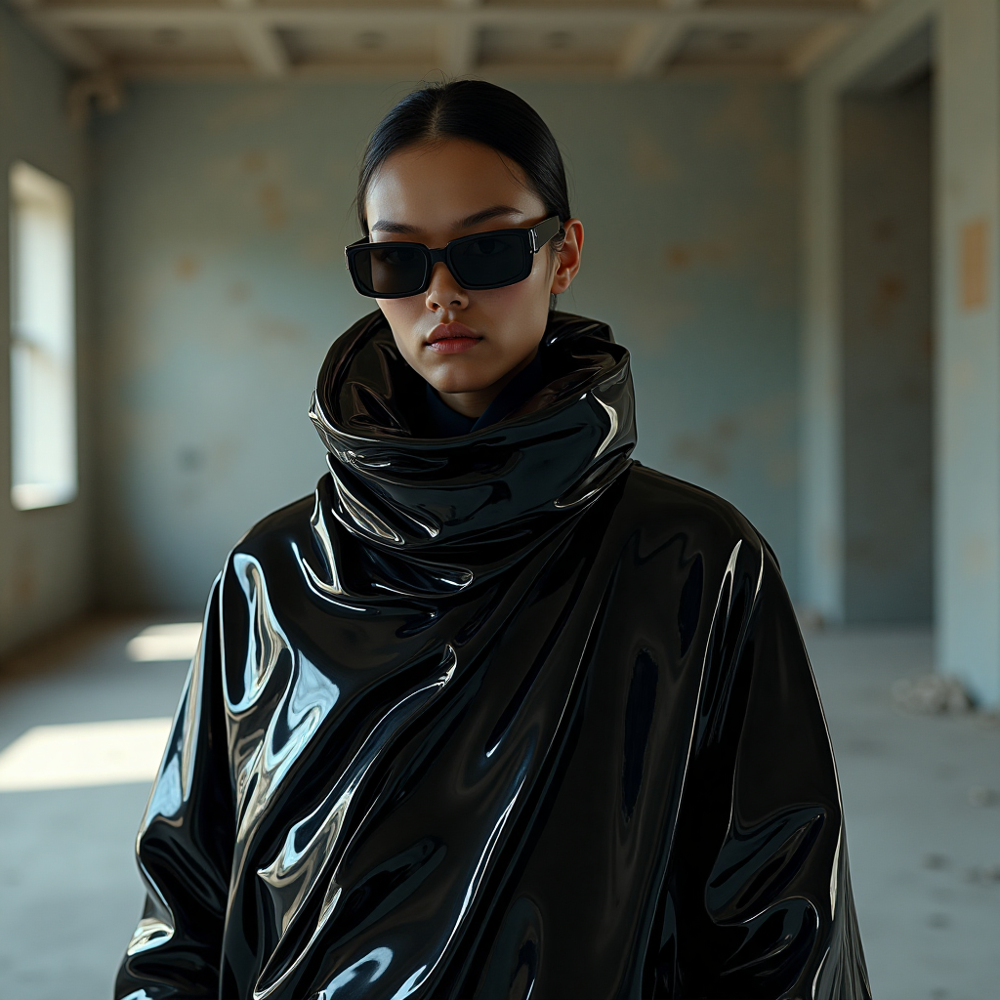

# ComfyUI-TaylorSeer

[Read English Version](./README.md)

本项目是TaylorSeer项目的ComfyUI实现 [https://github.com/Shenyi-Z/TaylorSeer](https://github.com/Shenyi-Z/TaylorSeer)。

## 重要提示

请确保您的ComfyUI版本新于提交`c496e53`。

## 项目更新

- **更新**: ```2025/09/25```: 支持[TaylorSeer-Lite](https://github.com/Shenyi-Z/Cache4Diffusion/blob/main/HunyuanImage-2.1/run_hyimage_taylorseer_lite.py)，减少缓存的数量，模型运行的显存增加可忽略不计，基于TaylorSeer-Lite支持WAN 2.1/2.2模型。
- **更新**: ```2025/05/25```: 支持block swap功能，可以用更低的显存运行Hidream和FLUX模型
- **更新**: ```2025/05/13```: 支持Hidream，当checkpoint改变时，强制卸载旧模型显存
- **更新**: ```2025/04/30```: 首次发布，支持FLUX。

## 快速开始

### 安装

1. 导航到`ComfyUI/custom_nodes`
2. 克隆此仓库
3. 安装完成后运行ComfyUI！

### 运行工作流

[FLUX参考工作流](./examples/taylorseer_example_flux.json)

[Hidream参考工作流](./examples/taylorseer_example_hidream_full.json)

[FLUX-TaylorSeer-Lite参考工作流](./examples/taylorseerlite_example_flux.json)

[WAN-2.2-TaylorSeer-Lite参考工作流](./examples/taylorseerlite_example_wan2-2.json)

## 使用说明

### 使用TaylorSeer标准版

FLUX显存需求：缓存需要存储在GPU显存中以进行高效计算。对于使用FLUX FP8精度模型的1024*1024图像：

- 阶数0：增加VRAM使用量2GB
- 阶数1：增加VRAM使用量4GB
- 阶数2：增加VRAM使用量6GB

VRAM使用量随分辨率和图像数量线性增加。

Hidream显存需求：缓存需要存储在GPU显存中以进行高效计算。对于使用Hidream-full FP8精度模型的1024*1024图像：

- 阶数0：增加VRAM使用量5GB
- 阶数1：增加VRAM使用量10GB
- 阶数2：增加VRAM使用量15GB

VRAM使用量随分辨率和图像数量线性增加。

加速比例：`first_enhance`参数可以调整Taylor Cache介入的时间。当first_enhance = 10时，在30次迭代步骤下，结果与原始结果几乎无损，加速比可达2倍。

### 使用TaylorSeer-Lite

显存几乎零增长

## 与TeaCache对比

与TeaCache对比，TaylorSeer能够保持更高的加速比以及与原始图像相比更加一致的构图和元素。

| 提示词 | 原始结果 <br>(steps = 50, 2.42it/s) | TaylorSeer <br>(steps = 50, order = 1, first_enhance = 10, 5.73it/s) | TeaCache <br>(steps = 50, rel_l1_thresh = 0.25, 4.08it/s) | TeaCache <br>(steps = 50, rel_l1_thresh = 0.40, 5.32it/s) |
|--------|----------|------------|-----------|-----------|
| fashion photo of a model wearing black draped plastic fabric designed by Demna Gvasalia, standing in an apocalyptic room, sunglasses, synthetic light, 4K, photoreal, 3D render, | [](./sample_images/12_original.png) | [](./sample_images/12_TaylorSeer.png) | [](./sample_images/12_teacache_25.png) | [](./sample_images/12_teacache_40.png) |
| This picture depicts an anime scene that revolves around a young girl. She is characterized by purple hair tied into two ponytails, each decorated with a bow and pink earmuffs. The girl is wearing dark clothes, a vest-style top and shorts. She has a happy expression, a big smile on her face, and a pearl or something delicate in her mouth, as if she is jokingly feeding herself. | [](./sample_images/122_original.png) | [](./sample_images/122_TaylorSeer.png) | [](./sample_images/122_teacache_25.png) | [](./sample_images/122_teacache_40.png) |

## 许可证

本仓库中的代码在[GNU通用公共许可证v3.0](./LICENSE)下发布。
